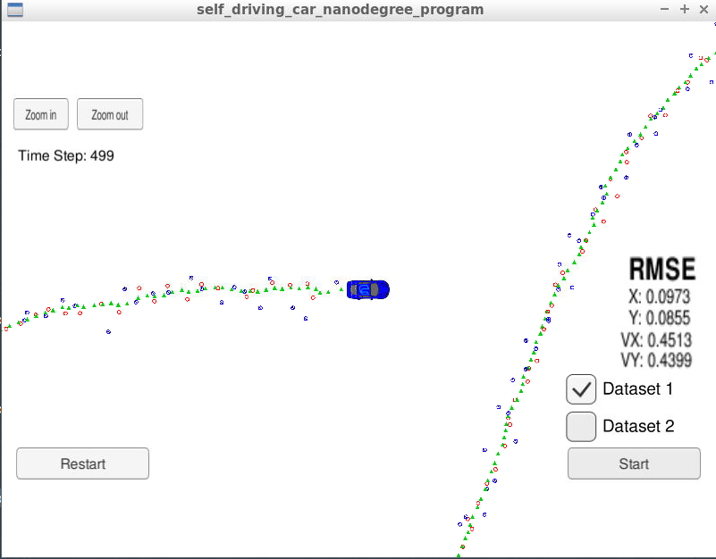
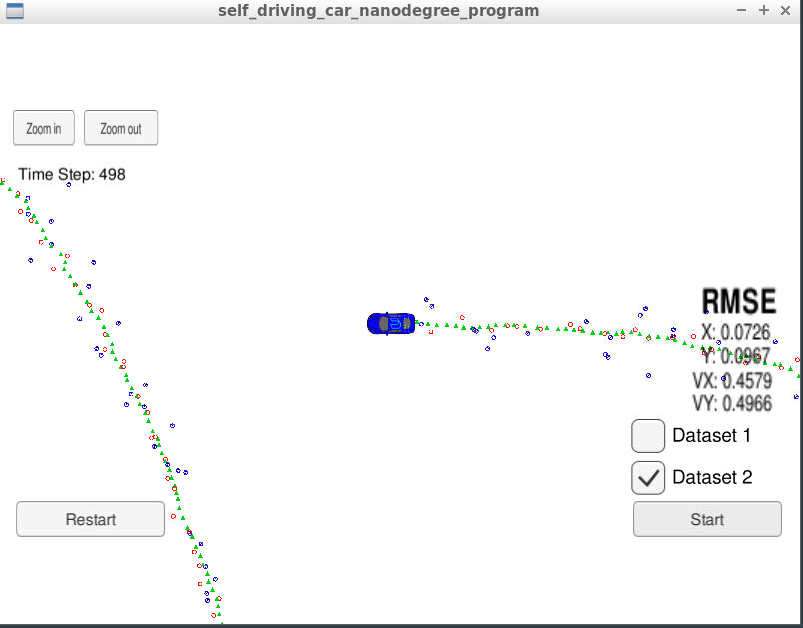
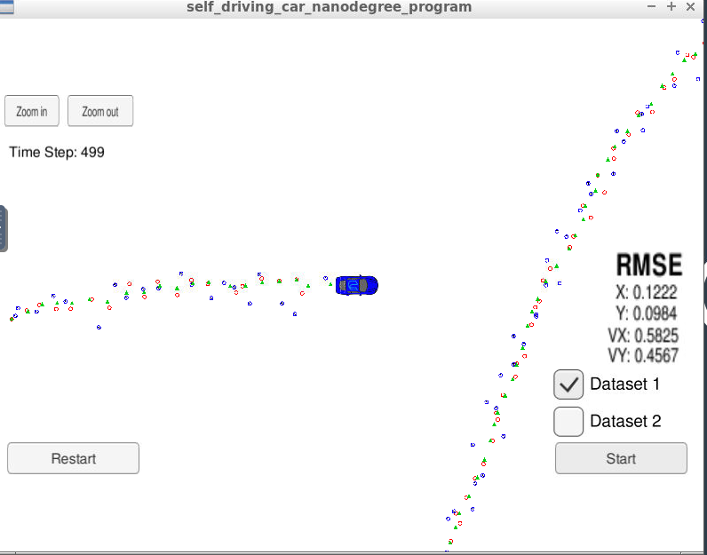
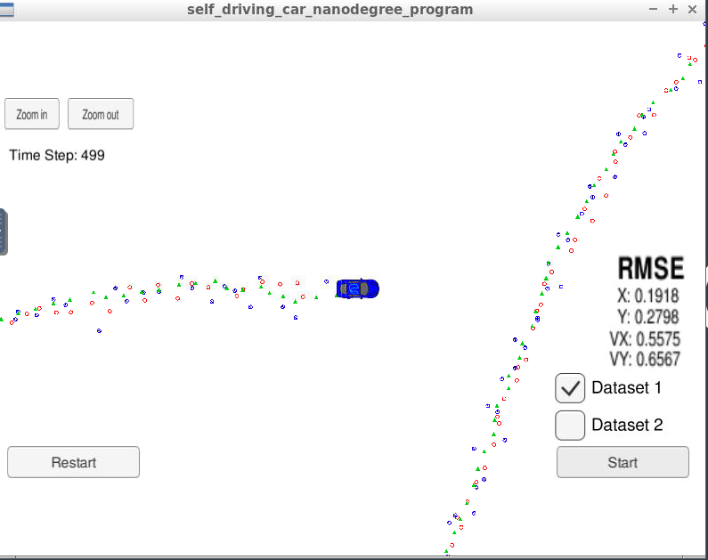

# CarND-Extended-Kalman-Filter-Project
Self-Driving Car Engineer Nanodegree Program - Extended Kalman Filter Implementation

This project consists of implementing an Extended Kalman Filter (EKF) with C ++. The objective is to track the position and velocity of a bicycle using Radar and Lidar measurements, which are generated in a simulator provided by Udacity ([link](https://github.com/udacity/self-driving-car-sim/releases) ). The EKF filter fuses these measurements to predict the position and velocity of the bicycle.

---

## 0. Rubric Points

This project consider the following rubric points ([link](https://review.udacity.com/#!/rubrics/1962/view) ).

## Compiling

The code should compile without errors. I did not modify the CMakeLists.txt provided by Udacity. The following steps show how to compile this project:

1. Clone this repo.
2. Make a build directory: `mkdir build && cd build`
3. Compile: `cmake .. && make` 
   * On windows, you may need to run: `cmake .. -G "Unix Makefiles" && make`
4. Run it: `./ExtendedKF `

## Runnig the EKF Filter - Accuracy

The following figure shows an image of the output visualized in the simulator for the dataset 1. The green triangles correspond to the filter estimation, the red circles are the lidar measurements, and the blue circles are the radar measurements.

In this project it is required to have a Root Mean Squared errors (RMSE) maximum of: [px = .11, py = .11,  vx = 0.52,  vy = 0.52] . Analyzing the results shown in the image, it is observed that my implementation meets this requirement, having an RMSE of [0.0973, 0.0855, 0.4513, 0.4399]. In addition to this, the image shows a well-defined trajectory of the estimated positions.

## Follows the Correct Algorithm.

TThe EKF implementation can be found in [src/kalman_filter.cpp](https://github.com/JKWalleiee/CarND-Extended-Kalman-Filter-Project/blob/master/src/kalman_filter.cpp). The processing flow can be found in [src/FusionEKF.cpp](https://github.com/JKWalleiee/CarND-Extended-Kalman-Filter-Project/blob/master/src/FusionEKF.cpp) (Update step in line 149 and Predict step in lines 162-172).

## Code Efficiency
An example of this calculation optimization is when the Q matrix is calculated ([src/FusionEKF.cpp](https://github.com/JKWalleiee/CarND-Extended-Kalman-Filter-Project/blob/master/src/FusionEKF.cpp) lines 138-146.)

## OPTIONAL

### Dataset 2
The following figure shows an image of the output visualized in the simulator for the dataset 1. The final RSME meets the required limits (<= [.11, .11, 0.52, 0.52] ).

### Turn of one sensor
I performed tests using only one sensor (laser or radar) of the Dataset 1. The following image shows the results using only laser measurements.

And the following image shows the results using only radar measurements.

From the information learned in the classes, I would expect that the estimated position using only laser would be more accurate than that estimated using only radar,  and, on the other hand, I would expect that the velocity estimated by the radar would be more accurate. 

Analyzing the individual results for each sensor, it is observed that, as expected, the positions estimated by the laser are more accurate than those estimated by the radar (RSME Laser p = [0.1222, 0.0984]) < RSME Radar p = [0.1918, 0.2798]), and the trajectory estimated by the radar is more irregular. However, the velocity assumption is not met, since the RMSE of the velocity is lower only for one of the velocity components of the radar (Vx) compared to the RSME velocity of the laser. This, however, may be due to two main reasons:
- The estimated velocity depends on the estimated position, then, the noise in the radar position affects the velocity estimation.
- In the velocity estimation a linear model is used, however, the trajectory of the vehicle in the simulator is non-linear.

Now, analyzing the results of a single sensor in comparison with the sensor fusion, it is observed that the estimations of the filter turning of one sensor are less precise than the estimation using sensor fusion, which shows the robustness that adds to the system the use of sensor fusion.

